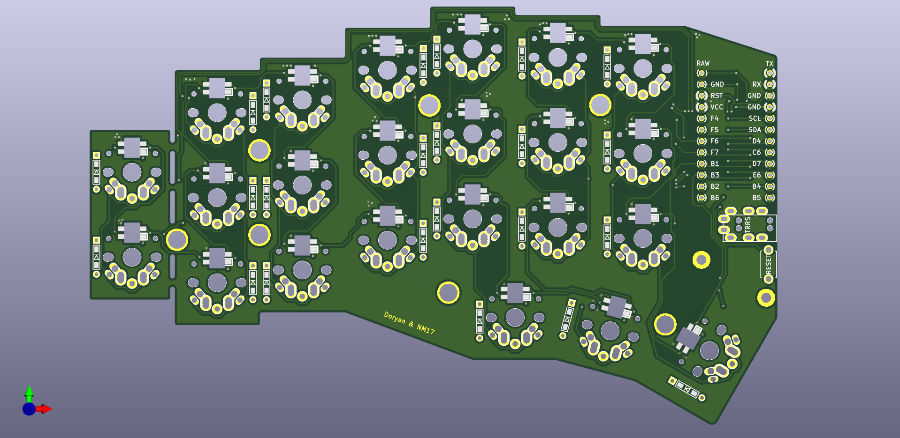

# Angel Wings Keyboard (by [@ItzAdel](https://github.com/ItzAdel) and [@nm17](https://github.com/nm17))

.jpg)

## PCB

### Angel Wings v.2.1 (recomended)

* [pcb.zip](https://github.com/ItzAdel/AngelWings-keyboard/blob/main/gerbers/pcb.zip?raw=true)

## Plates

### Top plate

* [top plate.zip](https://github.com/ItzAdel/AngelWings-keyboard/blob/main/gerbers/top%20plate.zip?raw=true)

### Bottom plate

* [bottom plate.zip](https://github.com/ItzAdel/AngelWings-keyboard/blob/main/gerbers/bottom%20plate.zip?raw=true)

# AWF is a ergo-split keyboard with 46 keys, originally designed for a school project.

.JPG)

.JPG)

.JPG)

.JPG)

.JPG)

## Check [wiki](https://github.com/ItzAdel/AngelWings-keyboard/wiki/INFO) for more info

## VIA

You can use the online version via to configure the keyboard

### Check out @tfk004 on Telegram. https://t.me/tfk004
