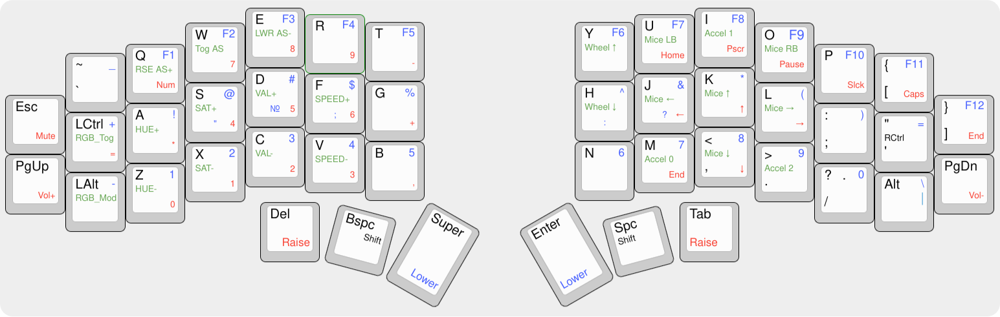

# Angel Wings Keyboard (by [@ItzAdel](https://github.com/doryan04) and [@nm17](https://github.com/nm17))

.jpg)

# Keymap

The blue symbols on the keymap are the symbols placed on the lower layer. Red is on the raise. Green is on adjust.

# AWF is a ergo-split keyboard with 46 keys, originally designed for a school project.

.jpg)

.jpg)

# Check [wiki](https://github.com/ItzAdel/AngelWings-keyboard/wiki/INFO) for more info

# Check out @tfk004 on Telegram. https://t.me/tfk004
