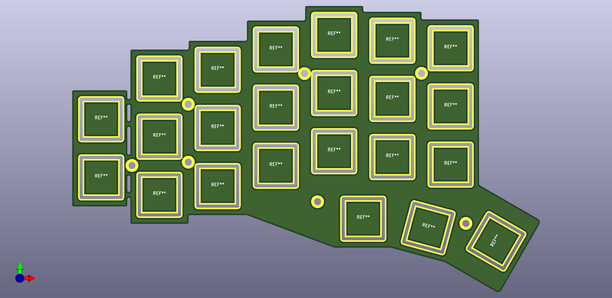
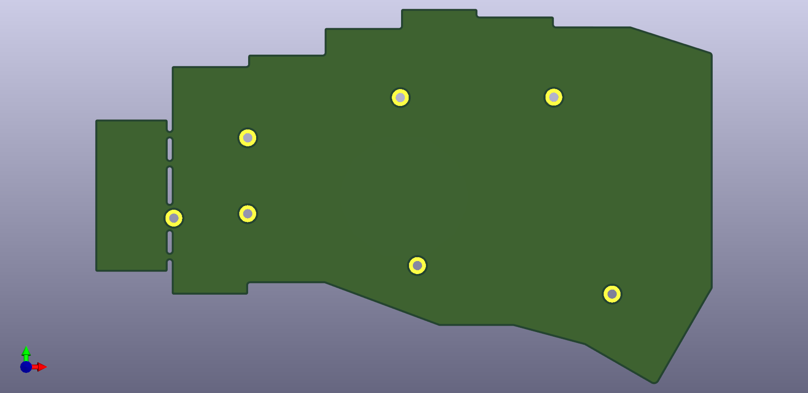
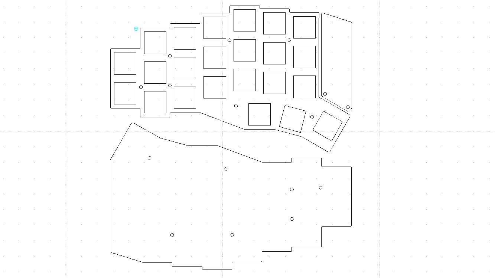
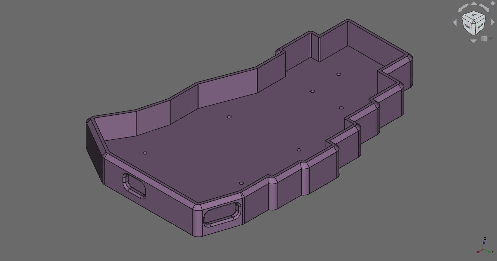
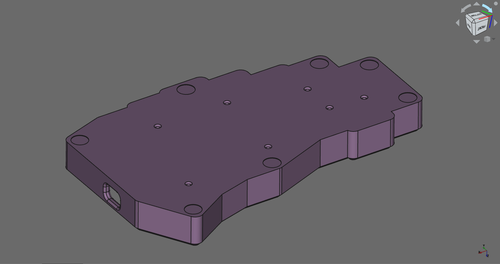
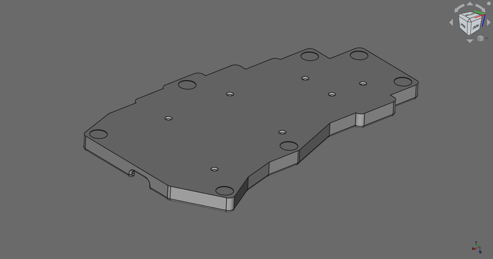
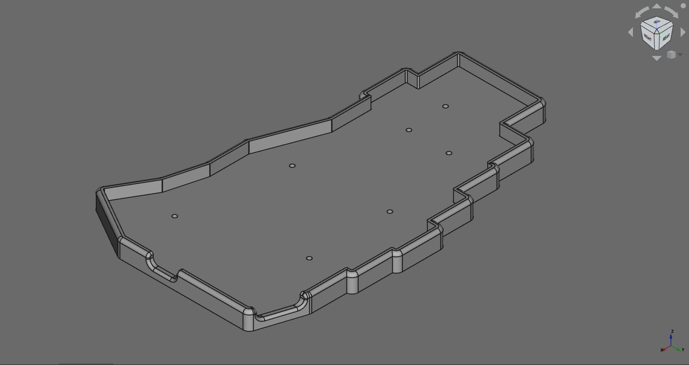

# WARNING!

## First solution

If you are a Linux user like me and get the error:
```
The display compositor is frequently crashing. Goodbye.
```
I strongly recommend to start VIA via console/terminal with the command:
```
$ sudo via --no-sandbox
```
Read more: https://github.com/the-via/releases/issues/179

## Second solution

Use online version [VIA](https://usevia.app/#/)

[](https://youtu.be/KcosSeNAZnk)

# How to compile firmware?

1) First you need to download QMK MSYS and enter the command in it:
```
qmk setup
```
2) After we installed QMK you need to create a folder called "angelwings" in the path:
```
"c:/users/user/qmk_firmware/keyboards"
```
and unpack all firmware files into the folder "angelwings".

3) The last step is compilation. Enter into QMK MSYS command:
```
qmk compile -kb angelwings -km default
```
or if you want VIA port:
```
qmk compile -kb angelwings -km via
```
4) If your firmware compiled - then let's have fun!

# Materials for build

Component                         |Quantity  |Price
----------------------------------|----------|--------------------------------------
[TRRS Cable 3.5mm](https://aliexpress.ru/item/4000104350398.html)| x1       | from $0.63
[Bumpons for legs (height 3mm)](https://aliexpress.ru/item/32912066603.html)| x1 | $2.96
[Arduino ProMicro](https://aliexpress.ru/item/32849563958.html)| x2       | $5.12 (microUSB) / $6.07 (USB Type C)
[TRRS Socket](https://aliexpress.ru/item/32368285821.html)| x2       | from $1.50 (20 pcs)
PCB                               | x2       | JLCPCB - from $10 / check on other sites
Bottom and top plate              | x2       | JLCPCB - from $20 ($10 top plate + $10 bottom plate) / check on other sites.
[Standoff M2 (8mm for MX / 4mm for Choc)](https://aliexpress.ru/item/32597776358.html)| x7       | $1.04 / $1.24 (50 pcs)
[Screw M2 6mm](https://aliexpress.ru/item/32970872802.html)| x14      | $1.70
Switch                            | x46      | You can buy very cheep switches or unsolder the switches from the donor keyboard.
Keycaps                           | x46      | You can buy very cheep keycaps or use from old keyboard.
[Diode 1N4148](https://aliexpress.ru/item/32822249056.html) or [1N4148 in SOD-123](https://aliexpress.ru/item/32849879904.html) | x46      | from $0.71 (100 pcs).

## Optional

Component                         |Quantity  |Price
----------------------------------|----------|--------------------------------------
[DIP switch](https://aliexpress.ru/item/1005002490728099.html)                        | x2       | $1.28
[RGB Light (SK6812mini)](https://aliexpress.ru/item/32623583544.html)            | x46      | $4.69 (50 pcs)

## PCB

### Angel Wings v.2.1 (recomended)

* [pcb.zip](https://github.com/ItzAdel/AngelWings-keyboard/blob/main/gerbers/pcb.zip?raw=true)


## Plates

### Top plate

* [top plate.zip](https://github.com/ItzAdel/AngelWings-keyboard/blob/main/gerbers/top%20plate.zip?raw=true)



### Bottom plate

* [bottom plate.zip](https://github.com/ItzAdel/AngelWings-keyboard/blob/main/gerbers/bottom%20plate.zip?raw=true)



### Bottom plate

* [bottom plate.zip](https://github.com/ItzAdel/AngelWings-keyboard/blob/main/gerbers/bottom%20plate.zip?raw=true)



## Cases

### MX

* [MX Case](https://www.thingiverse.com/thing:5429171)



### Choc

* [Choc Case](https://www.thingiverse.com/thing:5429170)

   

# VIP

- [ ] Cases
  - [X] Chock case (for 3d print)
  - [X] MX case (for 3d print)
  - [X] Bottom and top plates
  - [ ] IMK-like case
- [X] Firmware
  - [X] VIA port and starting programm on linux
  - [X] QMK firmware
  - [ ] ZMK firmware  
- [ ] Tutorial
  - [X] Materials
  - [ ] Guide
- [ ] Non-split keyboard

# Tutorial coming soon.
